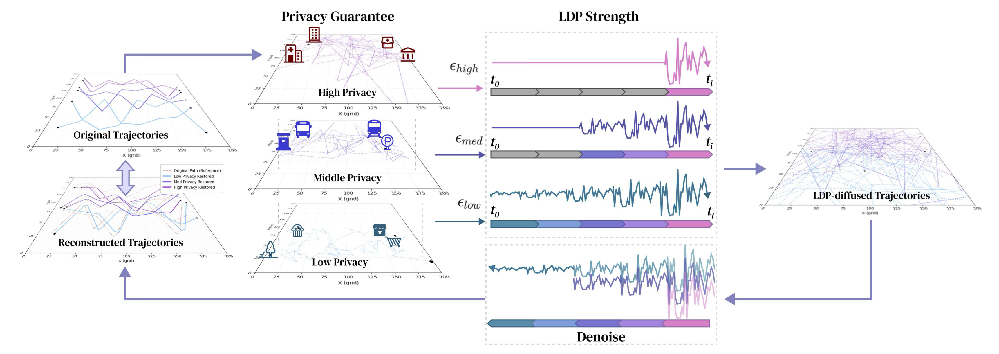

# LDP-DiffTraj

**LDP-DiffTraj** is a personalized diffusion-based framework for privacy-preserving human mobility trajectory generation under **Local Differential Privacy (LDP)**. This project builds upon the excellent **DiffTraj** implementation: [Original DiffTraj Repository](https://github.com/YasoZ/DiffTraj). 

The framework architecture is illustrated below: .

Model checkpoints (noise levels 0.0–1.0) and generated trajectories are publicly available on ModelScope: [LDP-DiffTraj @ ModelScope](https://modelscope.ai/models/Saihong/LDP-DiffTraj)

---

## 📦 Dataset

We use the **YJMob100K** dataset. Please download it from: [YJMob100K @ Zenodo](https://zenodo.org/records/10836269). 

After downloading, place the raw files in the `./data` directory.

---

## Preprocessing Pipeline

The preprocessing consists of four main steps:

### 1. Trajectory Segmentation
Run:
```bash
0-split-traj.ipynb
```
The original dataset contains one trajectory per user per day.  
This step splits daily trajectories into multiple sub-trajectories by detecting stops and moves.

### 2. Grid-level Privacy Scoring
Run:
```
1-grid-privacy.ipynb
```
This step:
- Assigns semantic privacy sensitivity scores to each spatial grid
- Identifies sensitive areas based on POI semantics

### 3. Privacy-aware Trajectory Generation
Run:
```
2-traj-privacy-dataset.ipynb
```
This script generates **10 privacy levels** of noisy trajectories by injecting calibrated noise according to trajectory-level privacy budgets.

Output:
- `./data_privacy` directory
- Multiple subfolders containing:
  - Trajectory features
  - Noisy trajectories at different privacy strengths

### 4. Sensitivity Analysis
Run:
```
3-sensitivity-analysis.ipynb
```
This step helps calculate upper bound privacy budget for each forward diffusion process and determine suitable hyperparameters for diffusion model training.

---

## Environment Setup
Python 3.8+ is recommended. Install dependencies with:
```bash
pip install -r requirements.txt
```

## Training

After generating the privacy-aware datasets, train the ldp diffusion model by running:
```bash
python main.py
```
The model is trained **only on noisy trajectories** under LDP settings, without access to clean trajectories.

---

## Evaluation

We provide multiple evaluation scripts covering trajectory similarity, distribution matching, and privacy-area utility:

| Metric | Script | Description |
|--------|--------|-------------|
| OD Similarity (SSIM) | `ssim_iterative.py` | Evaluation of origin-destination distribution similarity |
| Occupancy Similarity (SSIM) | `ssim_occupancy.py` | Spatial cell visit frequency similarity |
| Length JSD / Top‑4000 Pattern F1 | `jsd_metric.py` | Trajectory length distribution and high-frequency pattern preservation |
| Privacy-area Utility | `privacy.py` | Trajectory protection effectiveness in sensitive areas |

---

## Acknowledgments

This project is built upon [DiffTraj](https://github.com/YasoZ/DiffTraj). We sincerely thank the original authors for their excellent work.